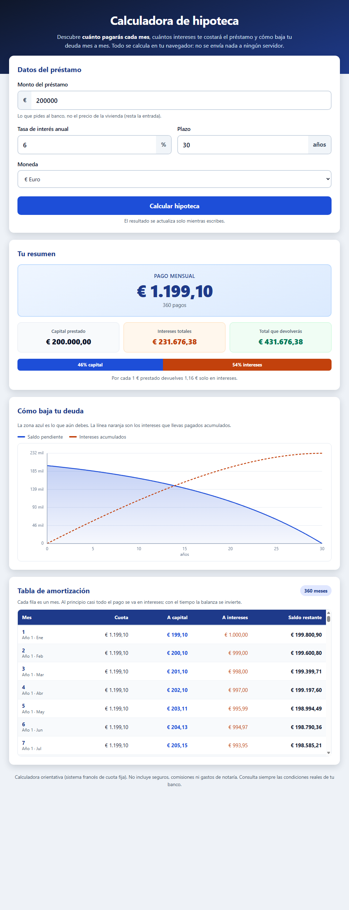

# Mortgage Calculator (Calculadora de hipoteca)

A self-contained web app that turns a loan amount, an interest rate and a term into the
three numbers that actually matter: **your monthly payment, what the loan really costs
you, and how your debt shrinks month by month**.

No build step, no CDNs, no `npm install`, no server. Open the HTML file and it works —
offline, and nothing ever leaves your browser.



## The problem it solves

Bank simulators give you one number — the monthly payment — and stop there. That hides
the part that costs you the most money:

- On a €200,000 loan at 6% over 30 years you pay back **€431,676**. More than half of
  that (**€231,676**) is interest, not the house.
- In month 1, €1,000 of your €1,199.10 payment goes to *interest* and only €199.10
  actually reduces your debt. Most people are surprised by that ratio.
- Shortening the term or shaving half a point off the rate changes the total by tens of
  thousands — but you can't see that without a full amortization schedule.

This calculator shows all of it: the payment, the total interest, the complete month-by-
month schedule, and a chart where the falling balance and the rising accumulated interest
cross over — the moment you finally start paying more principal than interest.

## How to open it

No installation required:

```bash
# Clone or download the repo, then just open the file
start index.html            # Windows
open index.html             # macOS
xdg-open index.html         # Linux
```

Or simply double-click `index.html` in your file explorer.

## How to use it

The app opens with a worked example already calculated, so you see results immediately.
Change any field and the results update as you type.

| Field | Meaning | Example |
|-------|---------|---------|
| **Monto del préstamo** | Amount borrowed — *not* the property price (subtract your down payment) | `200000` |
| **Tasa de interés anual** | Nominal annual rate, as a percentage | `6` |
| **Plazo** | Term, in years | `30` |
| **Moneda** | Display currency symbol (€, $, £, S/, MX$) | `€` |

**Worked example** — enter `200000` / `6` / `30` and you get:

```
Pago mensual .............  €  1,199.10   (360 payments)
Capital prestado .........  € 200,000.00
Intereses totales ........  € 231,676.38
Total que devolverás .....  € 431,676.38
→ 46% capital / 54% intereses
```

You also get:

- **Amortization table** — every month, showing the payment split into principal and
  interest plus the remaining balance. Scrollable, with a sticky header and a divider at
  the start of each year.
- **Balance chart** — drawn with the native `<canvas>` API (no charting library): the
  blue area is what you still owe, the dashed orange line is interest paid so far.

### Using the engine from your own code

The calculation engine is exported, so you can reuse it in Node:

```js
const H = require('./script.js');

H.calcularPagoMensual(200000, 6, 30);   // → 1199.1010499...
H.generarTablaAmortizacion(200000, 6, 30);
// → [{ mes: 1, pago: 1199.10, pagoCapital: 199.10,
//      pagoInteres: 1000, saldoRestante: 199800.90, ... }, ...]

const r = H.calcularHipoteca({ monto: 200000, tasaAnual: 6, anios: 30 });
r.pagoMensual;    // 1199.1010499...
r.interesTotal;   // 231676.38...
```

`script.js` exposes the engine as `module.exports` under Node and as `window.Hipoteca` in
the browser, and skips all DOM wiring when `document` is undefined. That way the tests
verify **exactly the same code** the interface runs, instead of a copy that drifts.

## Running the self-test

No dependencies — just Node:

```bash
node check.js     # exit code 0 if everything passes, 1 if anything fails
```

45 assertions across 7 groups: two textbook cases (200,000 @ 6% / 30y → **1199.10**, and
150,000 @ 4.5% / 15y → **1147.49**), internal consistency of the schedule (principal sums
to the loan, final balance is exactly 0, interest = previous balance × monthly rate), the
0% edge case, monotonic relationships, invalid input handling, and money formatting.
See [SELFTEST.md](SELFTEST.md) for the full breakdown and the real output.

## How the math works

Standard fixed-payment (French) amortization:

```
        P · i · (1 + i)^n
   M = ────────────────────      i = annual rate / 12 / 100 ,  n = years × 12
         (1 + i)^n − 1
```

Two edge cases worth noting:

- **0% interest** makes the formula indeterminate (0/0), so the principal is simply split
  evenly: `M = P / n`.
- **The final month is settled against the real remaining balance.** Carrying the
  theoretical payment 360 times leaves a few cents of rounding residue; closing the last
  row against the balance makes the principal column sum exactly to the loan and the
  final balance land on 0.

Not included: insurance, fees, notary costs, or variable-rate revisions. This is an
orientation tool, not a binding offer.

## Monetization angle

Mortgage keywords are among the highest-CPC verticals in online advertising, and anyone
running this calculator is a self-identified, high-intent buyer. The natural play is
**lead generation for mortgage brokers and comparison sites**: an embeddable white-label
widget with a "get matched with a lender" hand-off, priced per qualified lead. A second
tier is a **premium PDF export** — a branded, printable amortization schedule that real
estate agents and independent brokers can hand to clients as a paid add-on.

## Tech

Vanilla HTML, CSS and JavaScript. No frameworks, no dependencies, no build step.
Native `<canvas>` for the chart. Roughly 400 lines of JS, commented in Spanish.

```
calculadora-hipoteca/
├── index.html          Interface (Spanish)
├── styles.css          Styles — high contrast, responsive
├── script.js           Calculation engine + UI wiring (dual export)
├── check.js            45 automated assertions
├── SELFTEST.md         What is tested and how
└── ui_shots/
    ├── iter_1.png      Screenshot of the app with a worked example
    └── salida_check.txt  Literal output of `node check.js`
```

---

## En español

**Calculadora de hipoteca** — una app web que funciona abriendo `index.html`, sin instalar
nada, sin internet y sin enviar datos a ningún servidor.

Le das tres datos —**cuánto pides prestado, el interés anual y a cuántos años**— y te dice
al instante lo que de verdad importa:

- **Cuánto pagarás cada mes** (con 200.000 € al 6% a 30 años: **1.199,10 €**).
- **Cuánto te costará el préstamo en total**: devolverás 431.676,38 €, de los cuales
  **231.676,38 € son solo intereses**. Más de la mitad.
- **La tabla mes a mes**: cuánto de cada cuota va a pagar tu deuda y cuánto se lo lleva el
  banco en intereses. El primer mes, de tus 1.199,10 € solo 199,10 € reducen la deuda.
- **Un gráfico** donde ves bajar tu deuda y subir los intereses acumulados, y el momento
  en que se cruzan.

**Cómo se usa:** abre `index.html` (doble clic). Ya viene con un ejemplo calculado; cambia
los campos y los resultados se actualizan mientras escribes. Puedes elegir la moneda
(€, $, £, S/, MX$).

**Cómo se comprueba que las cuentas están bien:** `node check.js` ejecuta 45 pruebas
automáticas y termina con código 0 si todo va bien. Está documentado en `SELFTEST.md`.

**Aviso:** es una calculadora orientativa (sistema francés de cuota fija). No incluye
seguros, comisiones ni gastos de notaría. Consulta siempre las condiciones reales de tu
banco.
