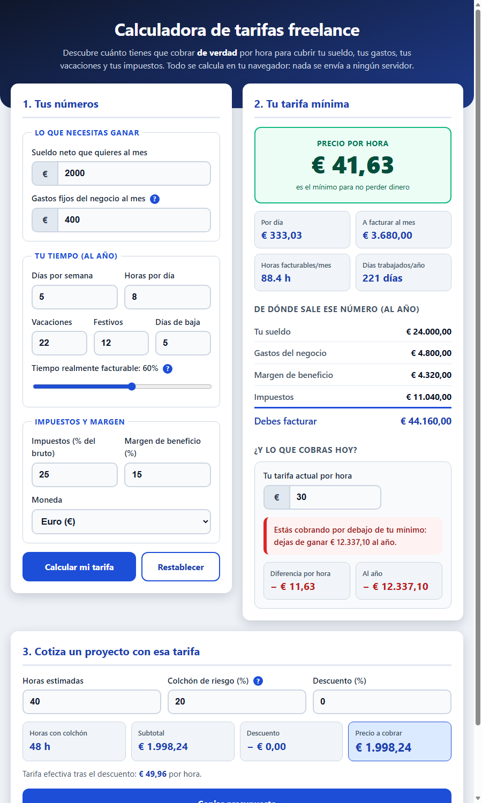

# Freelance Rate Calculator · Calculadora de tarifas freelance

**▶ [Demo en vivo — live demo](https://agc-calculadora-tarifas-freelance.pages.dev)**

Work out the **hourly rate you actually need to charge** as a freelancer — not the one you
guessed. It accounts for the things that quietly eat your margin: business expenses,
holidays, sick days, non-billable time (admin, sales, proposals), taxes and profit margin.
Then it turns that rate into a ready-to-send project quote.

100% offline: a single HTML file plus CSS and JS. No CDNs, no build step, no npm install,
no data leaves the browser.



## Why it exists

Most freelancers divide their target salary by 160 hours and call it a rate. That maths is
wrong: nobody bills 8 hours a day, 12 months a year, and taxes are not a surcharge you add
on top — they come *out of* what you invoice. With realistic defaults (60% billable time,
22 holidays, 25% tax) a €2,000/month target becomes **€41.63/h**, not €12.50/h.

## Features

- **Real billable hours** — days/week, hours/day, holidays, public holidays, sick-day buffer and a utilisation slider.
- **Correct tax maths** — the gross figure is *solved for*, not marked up: `gross = cost / (1 - tax%)`.
- **Full breakdown** — salary, expenses, margin, taxes and the total you must invoice per year.
- **Reality check** — type what you charge today and see the gap per hour *and per year* ("you are leaving €12,337 on the table").
- **Project quoting** — estimated hours + risk buffer + commercial discount, with the *effective* hourly rate you end up earning.
- **Copy quote to clipboard** as plain text, ready to paste into an email.
- **Sane guardrails** — invalid or absurd input is clamped, never `NaN`; contextual warnings when the numbers are unrealistic.
- Multi-currency display (€, $, MXN$, COP$, Bs) and Spanish UI with large, high-contrast controls.

## Run it

```bash
# Web app: just open the file, there is nothing to install
start index.html          # Windows
open index.html           # macOS
xdg-open index.html       # Linux
```

```bash
# Verify the calculation engine (44 assertions, no browser, no dependencies)
node check.js
echo $?                   # 0 = all good
```

## Use the engine from Node

`src/tarifas.js` is dependency-free and works both in the browser and in Node, so you can
reuse it in a CLI, a bot or a backend:

```js
const T = require('./src/tarifas.js');

const r = T.calcularTarifa({
  sueldoMensual: 2000,   // net salary you want per month
  gastosMensuales: 400,  // fixed business expenses per month
  diasSemana: 5,
  horasDia: 8,
  diasVacaciones: 22,
  diasFestivos: 12,
  diasEnfermedad: 5,
  utilizacion: 60,       // % of your day that is actually billable
  impuestos: 25,         // % tax on gross income
  margen: 15             // % profit margin
});

console.log(r.tarifaHora);             // 41.63  -> minimum hourly rate
console.log(r.ingresoBrutoNecesario);  // 44160  -> you must invoice this per year
console.log(r.horasFacturablesMes);    // 88.4   -> billable hours per month

const q = T.cotizarProyecto({ horas: 40, tarifaHora: 41.63, riesgo: 20, descuento: 10 });
console.log(q.total);            // 1798.42 -> price to quote
console.log(q.tarifaEfectiva);   // 44.96   -> what you really earn per estimated hour

const gap = T.compararTarifa({ tarifaActual: 30, tarifaMinima: r.tarifaHora,
                               horasFacturables: r.horasFacturables });
console.log(gap.veredicto);        // 'baja'     -> below your minimum
console.log(gap.diferenciaAnual);  // -12337.10  -> money lost per year
```

## Project structure

```
calculadora-tarifas-freelance/
├─ index.html        # UI (Spanish)
├─ styles.css        # styles, no frameworks
├─ app.js            # UI ↔ engine wiring
├─ src/tarifas.js    # calculation engine (browser + Node)
├─ check.js          # 44-assertion verification script, exit 0/1
├─ SELFTEST.md       # what is tested and the real output
├─ public/           # exactly what is deployed to Cloudflare Pages
└─ ui_shots/         # screenshots of each iteration
```

## Deploy

`public/` holds only what the browser needs (`index.html`, `styles.css`, `app.js`,
`src/tarifas.js`). It is a static folder — any host works:

```bash
npx --yes wrangler pages deploy public \
  --project-name=agc-calculadora-tarifas-freelance --branch=main --commit-dirty=true
```

## Verification

`node check.js` runs 44 assertions across 9 groups: base case, holidays, utilisation, tax
solving, expenses and margin, robustness against garbage input, project quoting, rate
comparison and money formatting. Real output is recorded in [SELFTEST.md](SELFTEST.md).

```
Pruebas pasadas: 44 | fallidas: 0
RESULTADO: TODO OK
```

## Monetization angle

Freelance rate calculators are proven lead magnets for accounting/invoicing SaaS, coaching
and freelance marketplaces: the visitor arrives with the exact intent ("am I charging
enough?") and leaves with a number they want to act on. Natural upsells: a paid PDF quote
with your branding, saved client/rate profiles, and a "compare my rate to my market"
report. It's also a fast white-label sell to gestorías and freelance communities.

---

## Español

### Qué resuelve

Casi ningún freelance sabe cuánto tiene que cobrar. Dividir el sueldo que quieres entre 160
horas es un error: nadie factura 8 horas al día todos los días del año, y los impuestos no
se suman encima — salen de lo que facturas. Esta calculadora hace las cuentas bien:
descuenta vacaciones, festivos, días de baja y el tiempo que se te va en administración y
buscar clientes, despeja los impuestos del bruto y añade tu margen. Después convierte esa
tarifa en un presupuesto listo para enviar.

### Cómo usarla

0. Pruébala online: **[agc-calculadora-tarifas-freelance.pages.dev](https://agc-calculadora-tarifas-freelance.pages.dev)**
1. O ábrela en tu equipo: `index.html` con doble clic (no hace falta instalar nada, funciona sin internet).
2. Rellena tu sueldo objetivo, tus gastos y tu tiempo real de trabajo.
3. Mira tu **precio por hora mínimo** y el desglose de dónde sale.
4. Escribe lo que cobras hoy en «¿Y lo que cobras hoy?» para ver cuánto dinero dejas de
   ganar (o de más) al año.
5. En el panel 3, mete las horas estimadas de un proyecto y pulsa **Copiar presupuesto**.

Ejemplo con los valores por defecto (2.000 €/mes de sueldo, 400 €/mes de gastos, 60%
facturable, 25% de impuestos, 15% de margen): **41,63 € la hora**, 44.160 € a facturar al
año y 88,4 horas facturables al mes.

### Cómo comprobar que funciona

```bash
node check.js     # 44 pruebas, sin dependencias; devuelve 0 si todo va bien
```

### Ángulo de monetización

Funciona como imán de clientes para software de facturación, gestorías y formación para
freelancers: quien entra ya tiene la intención de saber si cobra poco. De ahí salen ventas
naturales: presupuesto en PDF con tu marca, perfiles de tarifas guardados y comparación con
el mercado.
