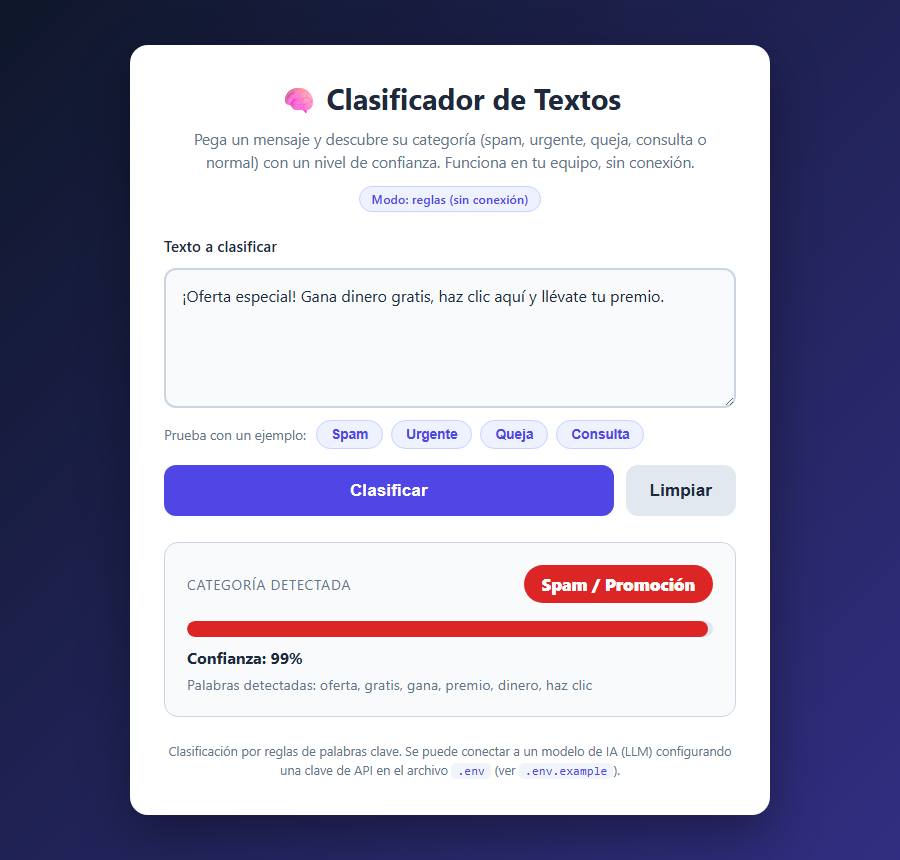

# Clasificador de Textos con IA 🧠

Una **app web sencilla** que lee un mensaje y te dice a qué **categoría** pertenece:
**spam**, **urgente**, **queja**, **consulta** o **normal**, junto con un **nivel de
confianza** (0-100%). Ideal para ordenar correos, mensajes de clientes o formularios.

Funciona **en tu equipo, sin conexión y sin instalar nada**. Por defecto usa un sistema
de **reglas** (palabras clave); además está preparada para conectarse a un modelo de IA
(LLM) si configuras una clave de API (ver `.env.example`).



## Cómo usarla (3 pasos)

1. Abre el archivo **`index.html`** con doble clic (se abre en tu navegador).
2. Escribe o pega el texto en el recuadro (o pulsa un ejemplo).
3. Pulsa **Clasificar**: verás la categoría, la barra de confianza y las palabras que
   se detectaron.

> Consejo: puedes compartir un resultado con un enlace como
> `index.html?texto=Oferta%20gratis` (clasifica automáticamente al abrir).

## Categorías y cómo se decide

| Categoría | Ejemplos de palabras clave |
|-----------|----------------------------|
| **Spam / Promoción** | oferta, gratis, gana, premio, dinero, haz clic… |
| **Urgente** | urge, emergencia, cuanto antes, ahora mismo, crítico… |
| **Queja / Reclamo** | queja, reclamo, defectuoso, reembolso, exijo… |
| **Consulta / Pregunta** | duda, información, cuánto cuesta, horario, ? … |
| **Normal** | cuando no hay palabras clave especiales |

La categoría con más coincidencias gana; la confianza sube según cuántas palabras clave
aparecen y su peso frente al total.

## Conectar un modelo de IA (opcional)

El clasificador funciona 100% por reglas sin configurar nada. Si quieres usar un LLM:

1. Copia `.env.example` como `.env` y pon tu `LLM_API_KEY` y `LLM_MODEL` reales.
2. La llamada al LLM debe hacerse desde un **backend** (no desde el navegador, para no
   exponer la clave). En `script.js` está el flag `usarLLM` y un ejemplo comentado.

**Nunca** se incluyen claves reales en este proyecto: `.env.example` solo trae valores de
ejemplo.

## Verificación

```
node check.js
```

Prueba la función `clasificarTexto` (spam, urgente, queja, consulta, normal y robustez).
Sale con código 0 si todo está bien. Ver detalles en `SELFTEST.md`.

## Ángulo de monetización

Herramienta gancho para atención al cliente y bandejas de entrada. Una versión "Pro"
podría clasificar con un LLM real, aprender categorías personalizadas, integrarse con
correo/CRM y procesar lotes por suscripción.

---

# AI Text Classifier 🧠 (English)

A **simple web app** that reads a message and tells you its **category**: **spam**,
**urgent**, **complaint**, **inquiry** or **normal**, with a **confidence level**
(0-100%). Great for triaging emails, customer messages or form submissions.

It runs **on your machine, offline, with no install**. By default it uses a **rule-based**
system (keywords); it's also ready to connect to an AI model (LLM) if you configure an API
key (see `.env.example`).


## How to use it (3 steps)

1. Open **`index.html`** by double-clicking it (opens in your browser).
2. Type or paste the text in the box (or click an example).
3. Click **Clasificar** (Classify): you'll see the category, the confidence bar and the
   detected keywords.

## Connecting an AI model (optional)

The classifier works 100% with rules out of the box. To use an LLM, copy `.env.example`
to `.env`, set your real `LLM_API_KEY` and `LLM_MODEL`, and call the LLM from a **backend**
(never from the browser, to avoid exposing the key). No real keys are ever committed.

## Verification

```
node check.js
```

Exits with code 0 if everything is fine. See `SELFTEST.md` for details.

---

_Proyecto del portafolio AGC — generado de forma autónoma._
