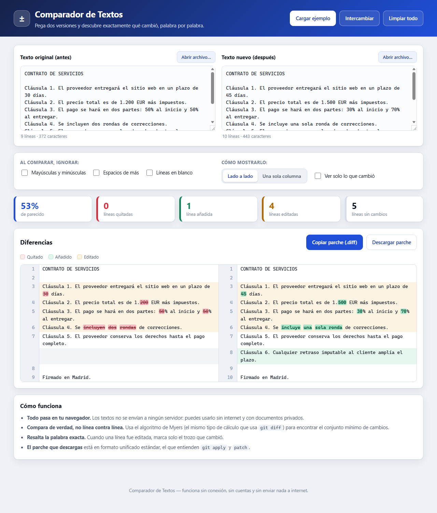
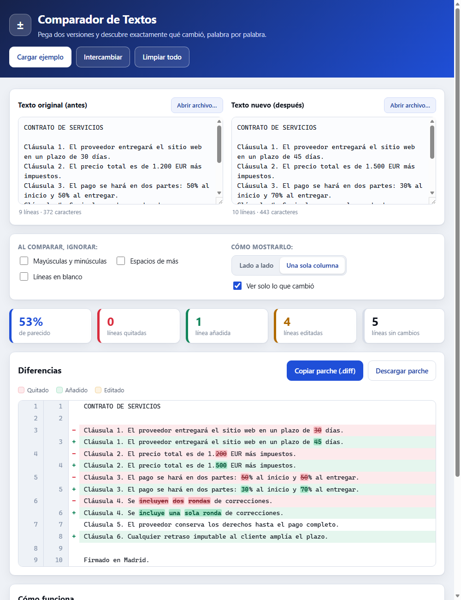

# Text Comparison Tool (Comparador de Textos)

A browser-based **diff tool** that shows exactly what changed between two versions of a
text — line by line and **word by word** — and exports the result as a standard
`.diff` patch. Everything runs locally: no server, no npm install, no CDN, no account.

**Live demo: https://agc-comparador-textos.pages.dev**



_Single-column view with unchanged lines collapsed:_



## The problem

You get "the updated version" of a contract, a config file, a translation, or a
piece of ad copy — and nobody tells you what actually changed. Reading both side by
side and hoping to spot a `1.200 EUR` that became `1.500 EUR` is slow and unreliable.

Developers have `git diff`, but it only helps if the text lives in a repository.
Everyone else pastes their documents into a random website — which means uploading a
contract, an invoice, or private client data to a server they know nothing about.

## The solution

Paste both versions and get an instant, precise answer:

- **Minimal edit script.** Uses **Myers' O(ND) diff algorithm** (the same family of
  algorithm behind `git diff`), not a naive line-by-line comparison. Inserting one
  line at the top does not report every following line as changed.
- **Word-level highlighting.** When a line was edited rather than replaced, only the
  changed words are highlighted — you see `1.200` → `1.500`, not a whole red line.
- **Smart pairing.** Two lines are shown as "one line edited" only when they are
  actually similar (character-level similarity ≥ 0.35); otherwise they are reported
  as a separate deletion and addition.
- **Comparison options.** Ignore case, ignore extra whitespace, ignore blank lines —
  useful for comparing reformatted code or re-exported documents.
- **Two views.** Side-by-side, or a single unified column. Plus "show only what
  changed", which collapses long unchanged stretches.
- **Real line numbers.** Even when blank lines are ignored, the numbers shown are the
  ones from the original document, so you can find the line in your editor.
- **Unified patch export.** Copy or download a standard unified diff (`@@ -l,c +l,c @@`)
  that `git apply` and `patch` understand.
- **100% local.** Nothing leaves the browser. Works with the network disconnected.

## How to run it

No build step, no dependencies.

```bash
# 1) Open the app
#    Just double-click index.html, or:
start index.html            # Windows
open index.html             # macOS

# 2) Run the automated checks (needs Node.js, no packages)
node check.js
```

`check.js` exercises the diff engine directly (it is a plain module that loads in both
Node and the browser) and exits with code `0` when everything passes. See
[SELFTEST.md](SELFTEST.md) for the full list of what is verified.

## How to use it

1. Paste the old version on the left, the new one on the right — or press
   **"Cargar ejemplo"** to see it working with a sample contract.
2. You can also click **"Abrir archivo…"** or drag a text file onto either box.
3. Read the summary cards: similarity %, lines removed, added, edited, unchanged.
4. Switch between **side-by-side** and **single column**, or tick **"Ver solo lo que
   cambió"** to hide the unchanged parts of a long document.
5. Press **"Copiar parche (.diff)"** or **"Descargar parche"** to take the changes
   somewhere else.

## Project layout

```
comparador-textos/
├── index.html        # UI (Spanish), no external resources
├── src/
│   ├── diff.js       # Diff engine — pure module, works in Node and the browser
│   ├── app.js        # DOM wiring and rendering
│   └── styles.css    # Styles
├── check.js          # Automated verification (node check.js → exit 0)
├── SELFTEST.md       # What the checks cover
└── ui_shots/         # Interface screenshots
```

## Deploy

The app is a static site with no backend, so it deploys as-is:

```bash
npx wrangler pages deploy . --project-name=agc-comparador-textos --branch=main
```

Live at **https://agc-comparador-textos.pages.dev** (Cloudflare Pages).

The engine is deliberately decoupled from the DOM: `src/diff.js` exports
`comparar()`, `diffUnificado()`, `compararEnLinea()`, `operaciones()` and friends, so
the same code that renders the page is the code covered by the tests.

## Monetization angle

The free tool is the funnel; the paid product is everything a team needs around it.

1. **Pro / desktop license (one-off or low subscription).** Compare whole folders,
   PDF and DOCX input, three-way merge, and a persistent history of comparisons.
   Individual professionals — translators, lawyers, editors — pay for this class of
   tool (Beyond Compare, Araxis Merge) precisely because their documents cannot be
   uploaded to a random website.
2. **Privacy as the selling point → B2B on-premise.** Law firms, clinics, accounting
   practices and public bodies cannot paste client documents into an online diff
   service. A self-hosted, audited build with the company logo, sold per seat or as a
   yearly site license, is an easy purchase for a compliance officer.
3. **White-label embed / SDK.** The engine is a dependency-free module with a clean
   API. It can be licensed to document-management, CMS, and contract-review products
   that need a "what changed in this version?" panel without shipping a heavy library.
4. **API on usage.** A hosted endpoint (`POST /diff` → structured JSON + patch) billed
   per call, for automation platforms (Zapier/Make/n8n) that need to detect changes
   between two versions of a page, a price list, or a legal document.
5. **Adjacent upsells.** Change-alerting for web pages and product feeds ("tell me when
   this competitor's terms change") is the same engine on a schedule, and is a
   recurring-revenue product.

Cost to run the free tier is effectively zero — it is a static site with no backend,
which keeps acquisition cheap while the paid tiers carry the margin.

---

## En español

**¿Qué es?** Una herramienta web para comparar dos versiones de un texto y ver
exactamente qué cambió: qué líneas se quitaron, cuáles se añadieron y, dentro de las
líneas editadas, **qué palabras concretas** cambiaron.

**¿Para qué sirve?** Para revisar un contrato que te devolvieron "con cambios", cotejar
dos versiones de un documento, comparar traducciones, o ver qué se tocó en un archivo
de configuración — sin tener que leerlo todo dos veces.

**¿Cómo se abre?** Haz doble clic en `index.html`. No necesita instalar nada, ni
internet, ni crear ninguna cuenta.

**¿Cómo se usa?**
1. Pega la versión vieja a la izquierda y la nueva a la derecha (o pulsa
   *Cargar ejemplo* para verlo funcionando).
2. También puedes abrir un archivo o arrastrarlo sobre cualquiera de las dos cajas.
3. Arriba aparece el resumen: porcentaje de parecido y cuántas líneas se quitaron,
   se añadieron o se editaron.
4. Puedes verlo *lado a lado* o en *una sola columna*, y marcar *Ver solo lo que
   cambió* para esconder las partes iguales.
5. Con *Copiar parche* o *Descargar parche* te llevas los cambios en el formato
   estándar `.diff`.

**Privacidad:** los textos nunca salen de tu computadora. Todo el cálculo se hace en
el navegador, así que puedes usarlo con documentos confidenciales y sin conexión.

**Verificación:** `node check.js` ejecuta las pruebas automáticas del motor de
comparación (ver [SELFTEST.md](SELFTEST.md)).
