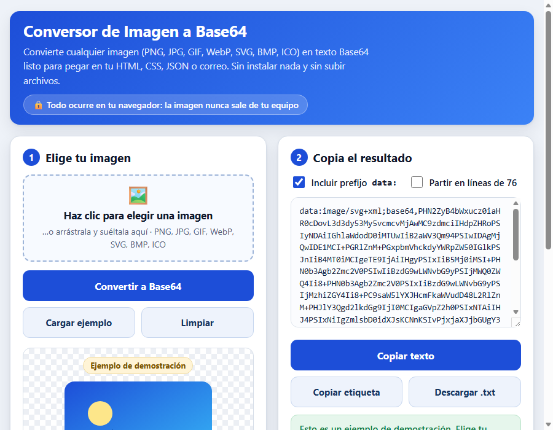

# 🖼️ Image to Base64 Converter (Conversor de Imagen a Base64)

🌐 **Live demo: [https://agc-conversor-imagen-base64.pages.dev](https://agc-conversor-imagen-base64.pages.dev)**

Turn any image — PNG, JPG, GIF, WebP, SVG, BMP, ICO — into a Base64 string you can paste
straight into your HTML, CSS, JSON or email template. It runs **100 % inside your
browser**: no install, no internet, no CDNs, and **your image is never uploaded anywhere**.

> The user interface is in Spanish, since it was built for Spanish-speaking users.
> This README is in English, with a Spanish summary at the bottom.



## The problem it solves

Embedding a small image in code means asking a designer for the file, hosting it
somewhere, and hoping the URL never breaks. Base64 removes all of that: the image
*becomes* the code. But the usual way to obtain it is pasting your file into a random
website — which means uploading a possibly private image to a stranger's server.

This tool does the same job **offline**, in a single HTML file you can double-click.

## How to run it

**Option 1 — online:** open
[agc-conversor-imagen-base64.pages.dev](https://agc-conversor-imagen-base64.pages.dev).
The image still never leaves your browser: the page does the work locally.

**Option 2 — offline:** download the `conversor-imagen-base64` folder and double-click
`index.html`. That's all — no build step, no `npm install`, no configuration. It also works from a USB
stick or with the Wi-Fi turned off.

## How to use it

1. **Choose an image** — click the drop zone, or drag the file onto it.
2. Press **«Convertir a Base64»** (Convert to Base64).
3. The result appears in the text box, together with the format, the original size, the
   pixel dimensions and how many characters the encoded text takes.
4. Copy it with **«Copiar texto»**, or use **«Copiar etiqueta &lt;img&gt;»** to get a
   ready-to-paste HTML tag. **«Descargar .txt»** saves the string as a file.

Two options shape the output:

| Option | Effect |
|--------|--------|
| **Incluir prefijo `data:`** | Emits a full data URI (`data:image/png;base64,iVBOR…`) instead of the raw Base64 — that's what an `` or a CSS `url()` needs |
| **Partir en líneas de 76** | Wraps the text at 76 characters, the MIME line length required by many email and mail-merge tools |

### Example

An 82-byte SVG icon becomes:

```html

```

Paste that anywhere and the image renders — with zero extra HTTP requests.

## Notable details

- **Format detected from the file's magic bytes**, not from its extension. A `.jpg` that
  is really a PNG is still tagged as PNG, so the data URI you get actually works.
- **Warning on heavy images**: Base64 grows a file by ~33 %, so the app shows the real
  growth percentage and warns above 100 KB, where inlining starts to hurt page load.
- **Hand-written encoder.** The conversion doesn't use the browser's `btoa()`; it's a
  RFC 4648 encoder/decoder in `base64.js` that also runs under Node.js — which is what
  makes it testable without a browser.
- Keyboard accessible drop zone, live region for status messages, and a layout that
  collapses to one column on phones.

## Verification

```bash
node check.js
```

Runs **72 dependency-free tests** and exits with code 0. It checks the encoder against
Node's own `Buffer.toString('base64')` across 16 different sizes (including every padding
case and a size past the encoder's internal 8 KB chunk boundary), round-trips the decoder
byte for byte, verifies magic-byte detection for 7 image formats, and then parses
`index.html` to confirm every required element exists, that no `getElementById` points at
a missing `id`, and that the page loads **zero external resources**.

The full breakdown — including what is *not* covered automatically — is in
**[SELFTEST.md](SELFTEST.md)**.

## Files

| File | Purpose |
|------|---------|
| `index.html` | Complete interface — HTML with embedded CSS and app JS |
| `base64.js` | Encoder/decoder, MIME detection and formatting helpers, shared by browser and Node |
| `check.js` | 72 automated tests, no dependencies |
| `SELFTEST.md` | Verification report with the real output |
| `ui_shots/` | Interface screenshots (visual progress evidence) |

The engine lives in its own file and is loaded both by the page and by the test script,
so the tests validate **exactly the code users run** — there is no second copy to drift.

## Monetization angle

The free tool covers single images. A **Pro tier** (one-off payment or a small
subscription) would add **batch conversion** of a whole folder into a ready-made CSS
sprite sheet or a JSON asset map, automatic compression before encoding (the single
biggest complaint about inline images is weight), SVG minification, and conversion in the
opposite direction — paste Base64, download the file back.

Because the encoder is already a standalone, framework-free module, two other revenue
paths are short steps away: selling it as a **paid REST API** billed per call for teams
that need image inlining inside their build pipelines, and a **white-label licence** so
CMS, email-marketing and e-commerce platforms can embed the converter under their own
brand. Finally, the "your file never leaves your computer" guarantee is a real selling
point for legal, medical and HR software — a **self-hosted, audit-friendly build** is
something those buyers pay for precisely because it *doesn't* touch the cloud.

---

## Resumen en español

**Conversor de imagen a Base64** que funciona 100 % en tu navegador: convierte PNG, JPG,
GIF, WebP, SVG, BMP o ICO en texto listo para pegar en tu HTML, CSS, JSON o correo, sin
instalar nada, sin conexión y **sin subir tu imagen a ningún servidor**.

**Cómo usarlo:** entra a
[agc-conversor-imagen-base64.pages.dev](https://agc-conversor-imagen-base64.pages.dev) o
descarga la carpeta y haz doble clic en `index.html`. Elige la imagen (o
arrástrala), pulsa «Convertir a Base64» y copia el resultado con un clic. Puedes copiar
directamente la etiqueta `` ya montada o descargar el texto como `.txt`. La app te
dice el formato real, el tamaño, las dimensiones y cuánto crece el archivo, y te avisa si
la imagen es demasiado pesada para incrustarla.

**Verificado** con 72 pruebas automáticas sin dependencias (`node check.js`, salida 0),
detalladas en [SELFTEST.md](SELFTEST.md).

**Ángulo de monetización:** versión Pro con conversión por lotes de carpetas enteras a
CSS/JSON, compresión automática antes de codificar y conversión inversa (Base64 →
archivo); el motor como **API de pago** por llamada para equipos que lo necesitan en sus
procesos de compilación; **licencia white-label** para CMS, plataformas de email marketing
y tiendas online; y una versión **autoalojada** para los sectores legal, médico y de
recursos humanos, donde la garantía de que el archivo nunca sale del equipo es justamente
lo que se paga.

---

Project from the [AGC Portfolio](../README.md) · HTML + CSS + JavaScript, zero dependencies.
