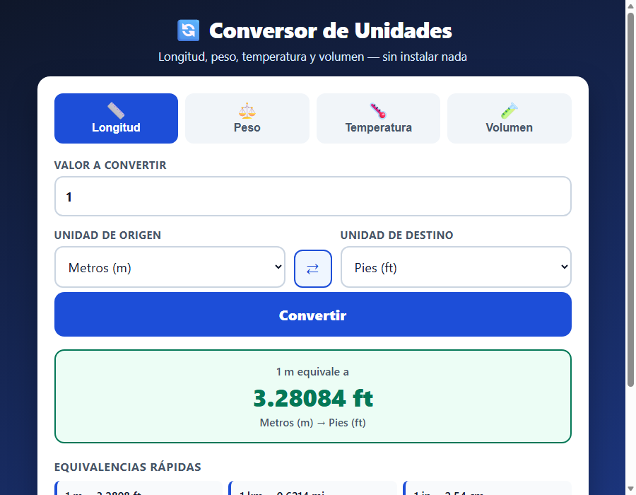

# 🔄 Unit Converter (Conversor de Unidades)

🌐 **Live demo: [https://agc-conversor-unidades.pages.dev](https://agc-conversor-unidades.pages.dev)**

A web unit converter for **length, weight, temperature and volume**. It runs 100 %
inside your browser: nothing to install, no internet required, no CDNs, and no data
ever leaves your machine.

> The user interface is in Spanish, since it was built for Spanish-speaking users.
> This README is in English; a short Spanish summary is at the bottom.



## How to open it

**Option 1 — online:** go to
[agc-conversor-unidades.pages.dev](https://agc-conversor-unidades.pages.dev). That's it.

**Option 2 — offline:** download the `conversor-unidades` folder and **double-click
`index.html`**. It opens in your browser and works immediately — no install, no build
step, no configuration.

## How to use it

1. Pick a **category** at the top: Longitud (length), Peso (weight), Temperatura
   (temperature) or Volumen (volume).
2. Type the **value** you want to convert (decimals accepted with either `.` or `,`).
3. Choose the **source unit** and the **target unit**.
4. Press **Convertir** — or just watch the result, which updates live as you type.
5. The **⇄** button swaps the two units in one click.

Below the result you'll find a **quick equivalents** table with the most common
conversions for the active category.

## Supported units

| Category | Units |
|----------|-------|
| **Length** | metres (m), centimetres (cm), millimetres (mm), kilometres (km), inches (in), feet (ft), yards (yd), miles (mi) |
| **Weight** | kilograms (kg), grams (g), pounds (lb), ounces (oz) |
| **Temperature** | Celsius (°C), Fahrenheit (°F), Kelvin (K) |
| **Volume** | litres (L), millilitres (mL), US gallons (gal), quarts (qt), pints (pt), cups (cup) |

Conversion factors are the exact international-standard values (for example
1 inch = 0.0254 m exactly), so results match the official tables.

## Verification

The conversion engine is covered by a dependency-free test script:

```bash
node test.js
```

It runs **38 tests** — at least one per category, plus round-trip conversions, number
formatting and error handling — and exits with code 0 when everything passes.

The full breakdown (what was tested, the real command output, and what is *not*
covered by automated tests) lives in **[SELFTEST.md](SELFTEST.md)**.

## Files

| File | Purpose |
|------|---------|
| `index.html` | Complete interface — HTML with embedded CSS and JS |
| `conversiones.js` | Conversion engine, shared by the browser and Node.js |
| `test.js` | Automated tests (38, no dependencies) |
| `SELFTEST.md` | Verification report with the real command output |
| `README.md` | This file |
| `ui_shots/` | Interface screenshots (visual progress evidence) |

The engine lives in its own file and is loaded both by the page and by the test
script, so the tests validate **exactly the code users run** — there is no second
copy to drift out of sync.

## Monetization angle

The free tier covers the four basic categories; a **premium version** (one-off payment
or a low subscription) would add professional units — pressure, energy, power, area,
speed and live currency rates — plus conversion history, favourites and CSV export.
Because the engine is already decoupled from the interface, shipping it as a **paid API**
billed per call is a short step: other sites and apps would pay to convert without
building it themselves. On top of that, a high-repeat-visit utility like this fits the
free model with **discreet ads** (and a paid ad-free option), or a **white-label licence**
so shops, workshops and schools can embed it under their own brand.

---

## Resumen en español

**Conversor de unidades** de longitud, peso, temperatura y volumen que funciona 100 %
en el navegador: sin instalar nada, sin internet y sin enviar datos a ningún servidor.
Para usarlo, entra a [agc-conversor-unidades.pages.dev](https://agc-conversor-unidades.pages.dev)
o descarga la carpeta y haz doble clic en `index.html`. Elige la categoría, escribe el
valor, selecciona las unidades y el resultado aparece al instante. La interfaz está en
español; verificado con 38 pruebas automáticas (`node test.js`, salida 0).

**Ángulo de monetización:** versión premium con unidades profesionales (presión,
energía, potencia, divisas en vivo), historial y exportación a CSV; el motor como **API
de pago** por volumen de llamadas; publicidad discreta con opción "sin anuncios"; y
licencia white-label para tiendas, talleres y escuelas.

---

Project from the [AGC Portfolio](../README.md) · HTML + CSS + JavaScript, zero dependencies.
