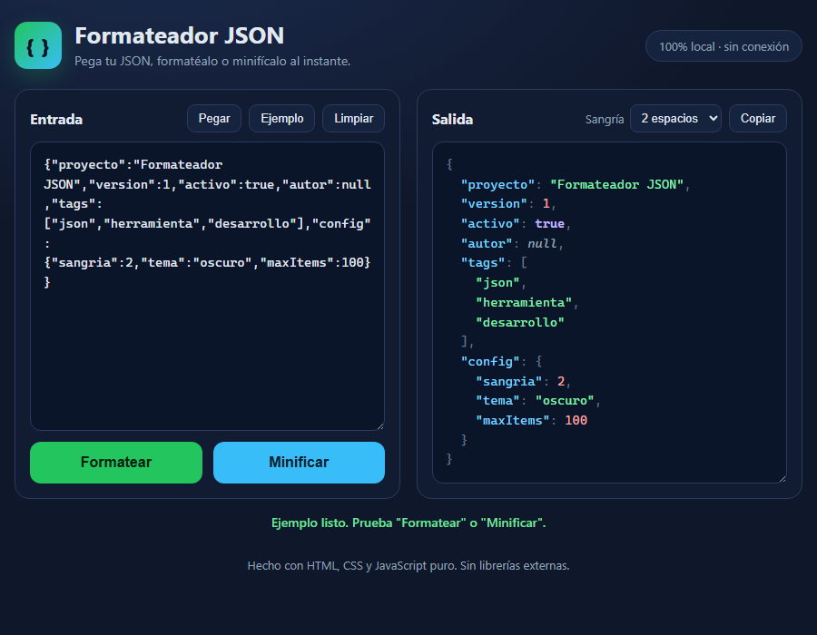

# Formateador JSON

Herramienta web autocontenida para **formatear** (embellecer) o **minificar**
JSON, con resaltado de sintaxis básico. Hecha con HTML, CSS y JavaScript puro:
**sin CDNs, sin npm y sin instalación**. Solo abre `index.html` en cualquier
navegador moderno.



## Qué hace

- **Formatear (embellecer):** convierte un JSON compacto en un documento legible
  e indentado.
- **Minificar:** elimina los espacios para producir el JSON válido más pequeño.
- **Resaltado de sintaxis:** claves, textos, números, booleanos y `null` con
  colores para leerlos mejor.
- **Sangría configurable:** 2 espacios, 4 espacios o tabulación.
- **Ayudas:** pegar desde el portapapeles, cargar un ejemplo, copiar el
  resultado y limpiar.
- **Validación:** si el JSON es inválido, muestra un mensaje de error claro con
  el motivo.
- **Atajo de teclado:** `Ctrl+Enter` formatea al instante.
- **100% local:** nada sale de tu equipo; funciona sin conexión.

La interfaz está en **español**, ya que apunta a desarrolladores hispanohablantes.

## Cómo se usa

1. Abre `index.html` en tu navegador (doble clic, no hace falta servidor).
2. Pega tu JSON en el área de **Entrada**.
3. Pulsa **Formatear** para embellecerlo o **Minificar** para compactarlo.
4. El resultado aparece resaltado a la derecha; usa **Copiar** para copiarlo.

## Cómo funciona por dentro

- **Formateo:** usa `JSON.parse(entrada)` seguido de
  `JSON.stringify(datos, null, sangría)`.
- **Minificado:** usa `JSON.stringify(datos)` (sin argumento de espaciado).
- **Resaltado:** un pequeño tokenizador (una sola regex) envuelve cada token en
  un `<span>` con su clase CSS. El texto se escapa como HTML primero para evitar
  inyección.

## Estructura del proyecto

```
formateador-json/
├── index.html      # Interfaz / maquetación
├── style.css       # Estilo oscuro y responsivo
├── script.js       # Lógica pura (formatear/minificar/resaltar) + interfaz
├── check.js        # Self test para Node (sin navegador)
├── SELFTEST.md     # Qué cubre el self test
├── README.md
└── ui_shots/       # Capturas de la interfaz (evidencia visual)
```

Las funciones puras de `script.js` se exportan para Node cuando existe `module`,
de modo que `check.js` puede probarlas sin navegador.

## Prueba automática (self test)

```bash
node check.js
```

Termina con código `0` cuando todas las comprobaciones pasan. Consulta
[SELFTEST.md](SELFTEST.md) para ver la lista de casos cubiertos.

## Ángulo de monetización

Aunque es una utilidad gratuita, encaja en varios modelos de ingreso reales:

- **Freemium web:** versión gratis local + plan de pago con extras (validación
  contra JSON Schema, conversión JSON↔YAML↔CSV, historial, guardado en la nube).
- **Extensión de navegador / plugin de editor:** empaquetar el formateador como
  extensión (Chrome/Edge/VS Code) con una versión Pro de pago.
- **API de formateo/validación:** ofrecer el mismo motor como endpoint de pago
  por volumen para integrarlo en pipelines y back-offices.
- **Marca blanca (white-label):** vender la herramienta personalizada a agencias
  o SaaS que quieran un formateador embebido con su logo.
- **Captación para portafolio:** como demo pública, atrae clientes de desarrollo
  a medida (es una pieza de vitrina que demuestra front-end limpio y sin
  dependencias).

Su bajo coste (100% estático, sin servidor) hace que el margen sea casi total si
se publica en un hosting gratuito como Cloudflare Pages.

---

## English (summary)

**Formateador JSON** ("JSON Formatter") is a self-contained web tool to beautify
or minify JSON, with basic syntax highlighting. Built with plain HTML, CSS and
JavaScript — no CDNs, no npm, no build step. Open `index.html` in any modern
browser, paste your JSON and click **Formatear** or **Minificar**. The UI is in
Spanish. Run the self test with `node check.js` (exits 0 when all checks pass).
