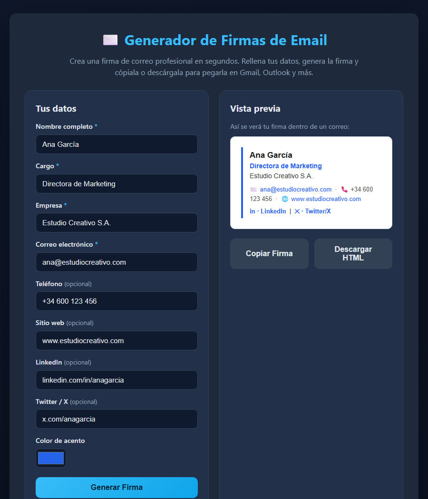

# Generador de Firmas de Email

🔗 **Demo en vivo:** https://agc-firmas-email.pages.dev

> **Por qué este proyecto.** Casi todo negocio, freelancer o profesional necesita una
> firma de correo que se vea limpia y consistente, pero armarla a mano en Gmail u
> Outlook es un dolor: los estilos se rompen, los enlaces no funcionan y no queda
> alineada. Las agencias literalmente **cobran** por diseñar y montar firmas HTML.
> Esta herramienta resuelve eso en segundos: rellenas un formulario, ves la firma en
> vivo y copias el HTML listo para pegar. Es pequeña, real, útil y 100% offline (sin
> servidores ni CDNs), lo que la hace fácil de publicar y de vender como plantilla o
> servicio. Encaja perfecto en un portafolio de herramientas prácticas.

## ¿Qué es?

Una app web que genera **firmas de correo profesionales** en HTML. Escribes tus datos
(nombre, cargo, empresa, correo, teléfono, sitio web, redes, logo, color) y la app
crea una firma lista para pegar en Gmail, Outlook y otros clientes de correo.

## Cómo abrirlo

1. Abre el archivo `index.html` con doble clic (o arrástralo a tu navegador).
2. Rellena tus datos, pulsa **“Generar Firma”** y verás la vista previa en vivo.
3. Usa **“Copiar Firma”** para pegarla en tu correo, o **“Descargar HTML”** para
   guardar el archivo `firma-correo.html`.
4. No necesita instalar nada ni conexión a internet.

> **Consejo:** abre `index.html?demo=1` para ver la app con datos de ejemplo ya
> cargados (modo demostración).



## Verificación

```bash
node check.js
```

Comprueba que la estructura base del proyecto esté completa y termina con código de
salida `0` si todo está bien. Ver detalles en [`SELFTEST.md`](SELFTEST.md).

## Ángulo de monetización

- **Servicio para agencias/freelancers:** cobrar por generar firmas corporativas
  consistentes para todo un equipo (una plantilla, muchos empleados).
- **Versión premium:** plantillas prediseñadas, exportación a imagen, firmas con banner
  promocional (call-to-action), guardado de varias firmas.
- **Marca blanca / SaaS:** ofrecerla embebida en herramientas de marketing o CRMs.
- **Lead magnet:** herramienta gratuita que capta clientes para otros servicios de
  diseño o branding.

## Estructura

```
generador-firmas-email/
├── index.html      Interfaz: formulario + vista previa + botones
├── style.css       Estilos (tema oscuro, vista previa tipo correo)
├── app.js          Lógica: generar, copiar y descargar la firma
├── check.js        Pruebas automáticas sin navegador (27 pruebas)
├── SELFTEST.md     Qué se prueba
└── ui_shots/       Capturas de la interfaz
```
