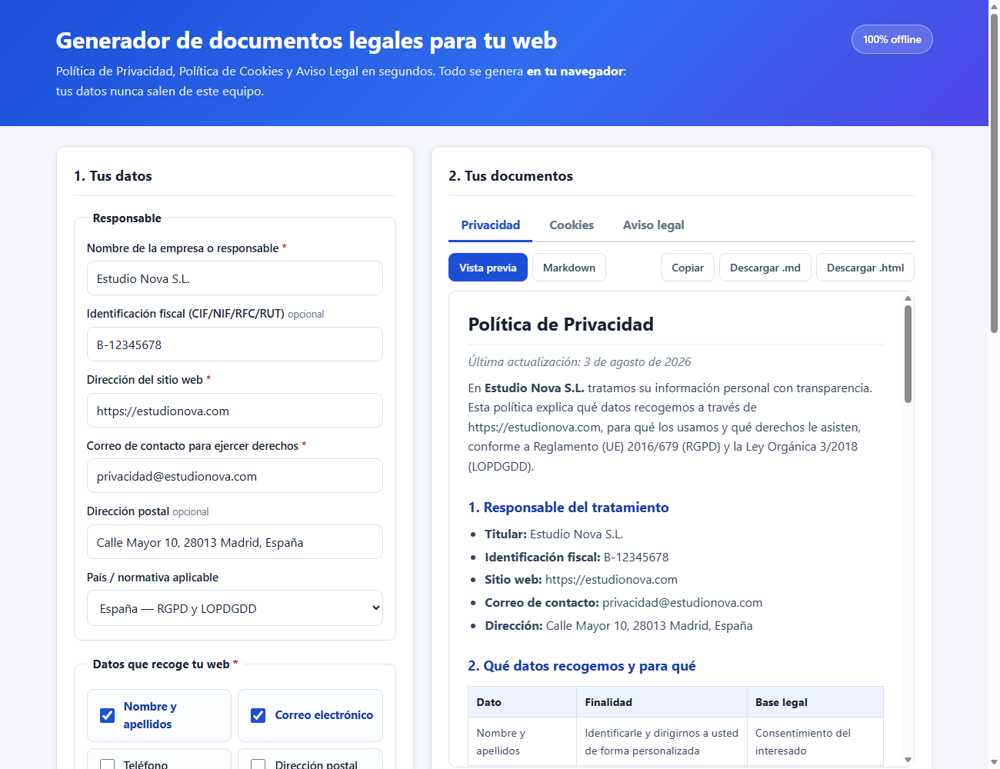

# Legal Docs Generator — Privacy Policy, Cookie Policy & Terms

Generate a **Privacy Policy**, a **Cookie Policy** and a **Legal Notice / Terms of Use**
for any website in about 30 seconds — entirely in the browser, with **zero dependencies,
zero CDNs and zero data leaving the machine**.

> 🔴 **Live demo:** https://agc-generador-politica-privacidad.pages.dev
> (add `?demo=1` to the URL to load a filled-in example)



## The problem

Every website that has a contact form, an analytics tag or a payment button is legally
required to publish a privacy policy. The usual options are bad:

| Option | Problem |
|--------|---------|
| Copy-paste a policy from another site | Wrong company data, wrong law, wrong retention period — and it is plagiarism |
| SaaS generators (Termly, iubenda…) | Subscription, account required, and **you upload your business data to a third party** |
| A lawyer | Correct, but overkill and expensive for a landing page or a small shop |

This tool sits in the gap: a serious, structured, **auditable** template you fill in with a
form. Nothing is uploaded — open `index.html` with the network cable unplugged and it still works.

## What makes the output actually usable

* **8 jurisdictions**, each with its real statute, supervisory authority and default minor age:
  EU (GDPR), Spain (GDPR + LOPDGDD), Mexico (LFPDPPP / INAI), Argentina (Ley 25.326),
  Colombia (Ley 1581), Chile (Ley 19.628), Peru (Ley 29733), California (CCPA/CPRA).
* **Rights sections adapt to the law**: GDPR countries get access/rectification/erasure/
  restriction/portability/objection; LATAM countries get the ARCO rights; California gets
  right-to-know, delete and opt-out of sale.
* **Legal basis per data type** — payment data is mapped to *contract + legal obligation*,
  IP addresses to *legitimate interest*, the rest to *consent*.
* **Conditional clauses**: the international-transfer clause, the newsletter clause and the
  third-party cookie table only appear if they apply to you. No dangling "N/A" sections.
* Three export formats: rendered preview, raw **Markdown**, and a **standalone HTML** file
  (self-styled, ready to drop into `/privacy`).

## Usage

### Open it (no build step)

```bash
git clone https://github.com/DilanProjects1001/portafolio-agc.git
cd portafolio-agc/generador-politica-privacidad
start index.html        # Windows   (macOS: open index.html — Linux: xdg-open index.html)
```

Fill the form → **Generar documentos** → switch tabs → **Copiar** or **Descargar**.
Your answers are cached in `localStorage`, so a reload does not lose your work.

### Use the engine from Node.js

`src/generator.js` is a dependency-free UMD module, so the same code that powers the UI can
be scripted — handy for agencies generating docs for many client sites at once:

```js
const legal = require('./src/generator.js');

const data = {
  empresa: 'Estudio Nova S.L.',
  identificacion: 'B-12345678',
  sitio: 'https://estudionova.com',
  email: 'privacidad@estudionova.com',
  direccion: 'Calle Mayor 10, 28013 Madrid, España',
  jurisdiccion: 'es',                       // ue | es | mx | ar | co | cl | pe | us
  datos: ['nombre', 'email', 'ip'],         // see legal.TIPOS_DATOS
  terceros: ['analytics', 'hosting'],       // see legal.TERCEROS
  cookiesAnaliticas: true,
  cookiesMarketing: false,
  transferencias: true,
  newsletter: true,
  retencion: 24,                            // months
  edadMinima: 14,
  fecha: '2026-08-03'
};

const check = legal.validar(data);
if (!check.ok) throw new Error(check.errores[0].mensaje);

const docs = legal.generarTodo(data);       // { privacidad, cookies, terminos } as Markdown

require('fs').writeFileSync('privacy.html',
  legal.documentoHtmlCompleto('Política de Privacidad', docs.privacidad));
```

Batch mode for an agency — one folder of ready-to-publish pages per client:

```js
const clients = require('./clients.json');
for (const c of clients) {
  const { privacidad } = legal.generarTodo(c);
  fs.mkdirSync(`out/${c.empresa}`, { recursive: true });
  fs.writeFileSync(`out/${c.empresa}/privacy.html`,
    legal.documentoHtmlCompleto('Política de Privacidad', privacidad));
}
```

### Public API

| Function | Returns |
|----------|---------|
| `validar(data)` | `{ ok, errores: [{campo, mensaje}] }` — field-level validation |
| `normalizar(data)` | Sanitised object with sane defaults (unknown keys dropped) |
| `generarPrivacidad / generarCookies / generarTerminos(data)` | Markdown string |
| `generarTodo(data)` | `{ privacidad, cookies, terminos }` |
| `markdownAHtml(md)` | HTML fragment (escapes user input — no XSS) |
| `documentoHtmlCompleto(title, md)` | Full self-styled HTML page |
| `JURISDICCIONES`, `TIPOS_DATOS`, `TERCEROS` | Catalogues you can iterate to build your own UI |

## Verification

A dependency-free test suite covers validation limits, per-jurisdiction wording, conditional
clauses, HTML escaping and the Markdown→HTML converter:

```bash
node check.js      # exit 0 = green
```

```
[1] Validación de datos de entrada        8 ok
[2] Política de Privacidad               10 ok
[3] Adaptación por jurisdicción           4 ok
[4] Política de Cookies                   3 ok
[5] Aviso Legal y Términos                1 ok
[6] Robustez del texto generado           3 ok
[7] Conversión Markdown → HTML            3 ok
[8] Integridad del proyecto               2 ok
====================================================
RESULTADO: 34/34 pruebas correctas ✔
```

Full log and coverage notes in [SELFTEST.md](SELFTEST.md).

## Project layout

```
generador-politica-privacidad/
├── index.html          # UI (Spanish, since the documents are in Spanish)
├── styles.css          # Responsive two-column layout, no framework
├── src/
│   ├── generator.js    # Legal engine — UMD, runs in browser and Node
│   └── app.js          # Form ↔ engine wiring, tabs, export, localStorage
├── check.js            # 34-assertion test suite (node check.js)
├── SELFTEST.md         # What is tested and why
└── ui_shots/           # Interface screenshots
```

## Monetization angle

Termly, iubenda and Privacy Policies charge **$10–$30/month** for essentially this template
engine — and require uploading your business data to their servers. A privacy-first,
self-hosted alternative sells on exactly that difference: a one-off licence, a white-label
embed for web agencies, or a paid tier with multi-site management and auto-updates when a
statute changes. For a freelance web developer it is also a closing tool: every client site
needs these three documents, and delivering them branded takes seconds instead of an
afternoon of copy-paste.

## Disclaimer

This generator produces a professional template from your answers. It is **not legal advice**
and does not replace a lawyer — review the text before publishing, especially if you process
special categories of data, profile users, or operate in a regulated sector.

---

## Español

**Generador de documentos legales para tu web.** Rellena un formulario y obtén tu
**Política de Privacidad**, **Política de Cookies** y **Aviso Legal** listos para publicar.

* Se genera **todo en tu navegador**: tus datos nunca salen de tu equipo (puedes usarlo sin internet).
* Se adapta al país: RGPD/LOPDGDD (España y UE), LFPDPPP (México), Ley 25.326 (Argentina),
  Ley 1581 (Colombia), Ley 19.628 (Chile), Ley 29733 (Perú) y CCPA (California).
* Los apartados aparecen solo si te aplican (boletín, transferencias internacionales, cookies de terceros).
* Descarga en **Markdown** o en **HTML** listo para subir, o cópialo al portapapeles.
* Sin registro, sin pagos, sin dependencias, sin CDNs.

**Cómo se abre:** descarga la carpeta y haz doble clic en `index.html`. Nada más.
También puedes probarlo en vivo: https://agc-generador-politica-privacidad.pages.dev

**Cómo se comprueba que funciona:** `node check.js` ejecuta 34 pruebas automáticas
(validaciones, textos por país, cláusulas condicionales, escapado de HTML) y termina en verde.

⚠️ **Aviso:** genera una plantilla profesional, pero no es asesoramiento jurídico.
Revisa el texto antes de publicarlo.
