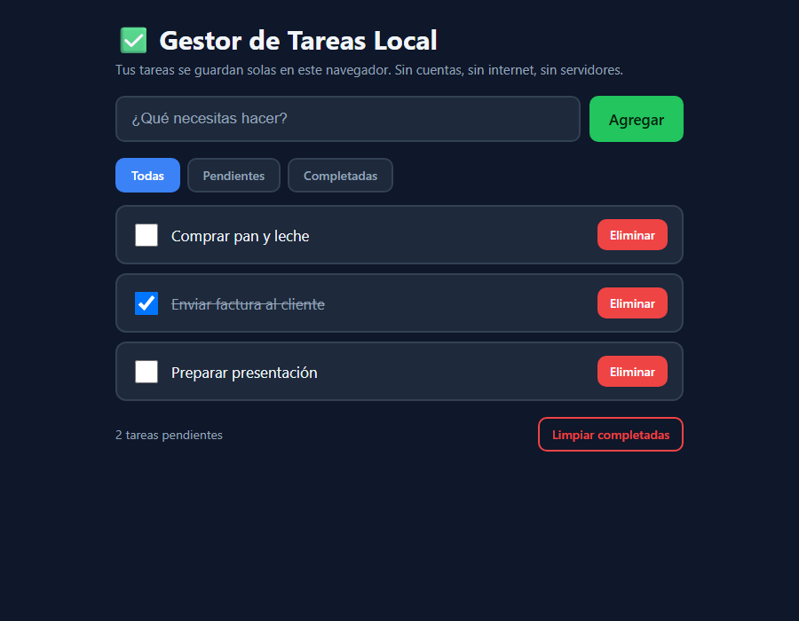

# Gestor de Tareas Local

Una lista de tareas (to-do) que funciona **100% en tu navegador**: sin cuentas,
sin internet y sin servidores. Todo se guarda solo en tu propio equipo.



## Qué es

Una aplicación web de una sola página para organizar tus pendientes del día.
Es un único archivo `index.html` (con su CSS y JavaScript embebidos), por lo que
no necesitas instalar nada ni conectarte a ningún lado. Al cerrar y volver a abrir,
tus tareas siguen ahí porque se guardan en el navegador (`localStorage`).

Funciones:
- **Agregar** tareas escribiendo y pulsando *Agregar* (o la tecla Enter).
- **Marcar como completada** con la casilla (la tarea se tacha).
- **Eliminar** tareas una por una.
- **Filtrar** entre *Todas*, *Pendientes* y *Completadas*.
- **Limpiar completadas** para borrar de golpe lo ya hecho.
- **Contador** de tareas pendientes siempre visible.
- **Guardado automático**: no hay botón de guardar, se guarda solo.

## Cómo usarlo

1. Abre el archivo `index.html` con doble clic (se abre en tu navegador).
2. Escribe una tarea en el campo *"¿Qué necesitas hacer?"* y pulsa **Agregar**
   (o la tecla **Enter**).
3. Marca la casilla de una tarea para darla por completada; púlsala de nuevo para
   reactivarla.
4. Usa los botones **Todas / Pendientes / Completadas** para filtrar la vista.
5. Pulsa **Eliminar** para quitar una tarea, o **Limpiar completadas** para borrar
   todas las terminadas.
6. Cierra el navegador cuando quieras: al volver a abrir el archivo, tus tareas
   seguirán guardadas.

> Nota: los datos se guardan por navegador y por equipo. Si abres el archivo en
> otro navegador u otra computadora, empezará con la lista vacía (es local a
> propósito, por privacidad).

## Cómo funciona

- Es un solo archivo HTML con **CSS y JavaScript embebidos**, sin CDNs ni librerías.
- La lógica está separada en dos capas:
  - **Lógica pura** (agregar, completar, eliminar, filtrar, guardar/cargar): son
    funciones que solo trabajan con datos, sin tocar la pantalla. Eso permite
    probarlas automáticamente sin navegador (ver `check.js` y `SELFTEST.md`).
  - **Capa de interfaz**: conecta esas funciones con los botones y la lista visible.
- La persistencia usa `localStorage` con la clave `gestor_tareas_local_v1`,
  guardando las tareas en formato JSON.

## Verificación

Este proyecto incluye un autotest que no requiere navegador:

```
node check.js
```

Debe terminar con **24 pruebas pasadas** y código de salida **0**. Los detalles
están en [`SELFTEST.md`](SELFTEST.md).

## Monetización

Base gratuita como gancho, y **versión Pro** (pago único o suscripción baja) con
extras: sincronización cifrada entre dispositivos, recordatorios, etiquetas y
proyectos, y exportación a PDF/CSV. También encaja como **plantilla white-label**
que se vende a pequeños negocios y freelancers que quieren un gestor de tareas
propio y sin costes de servidor, o como lead-magnet para captar clientes de una
suite de productividad más grande.
